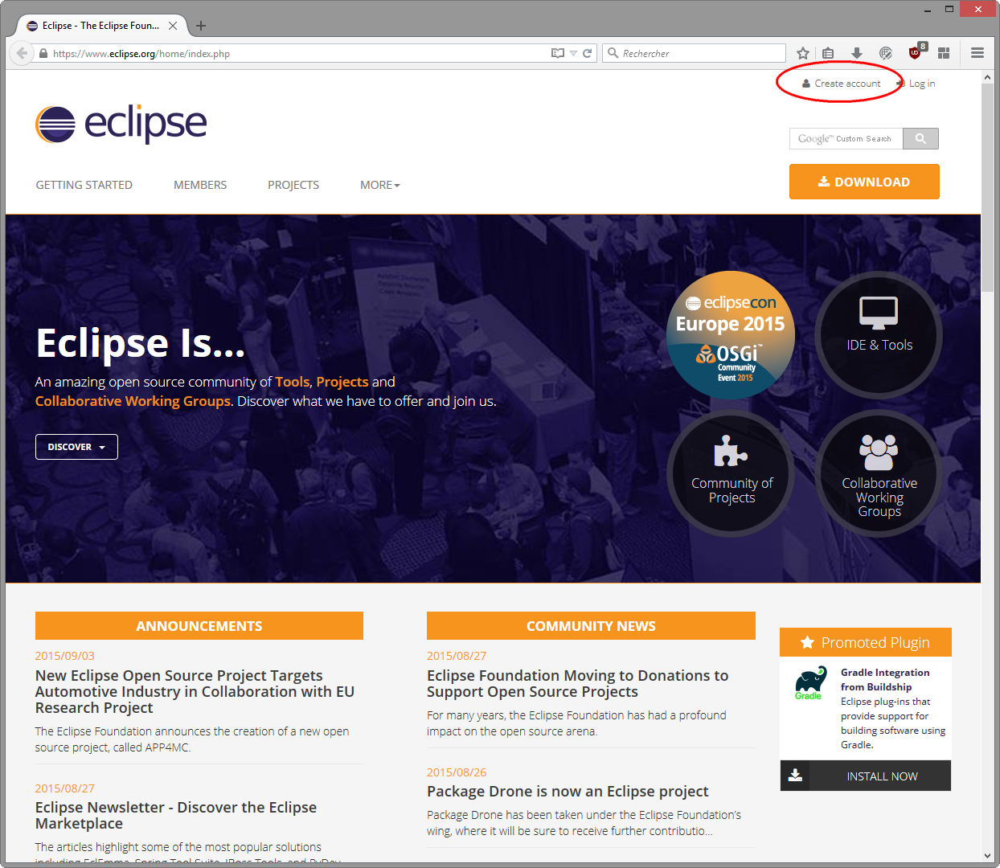
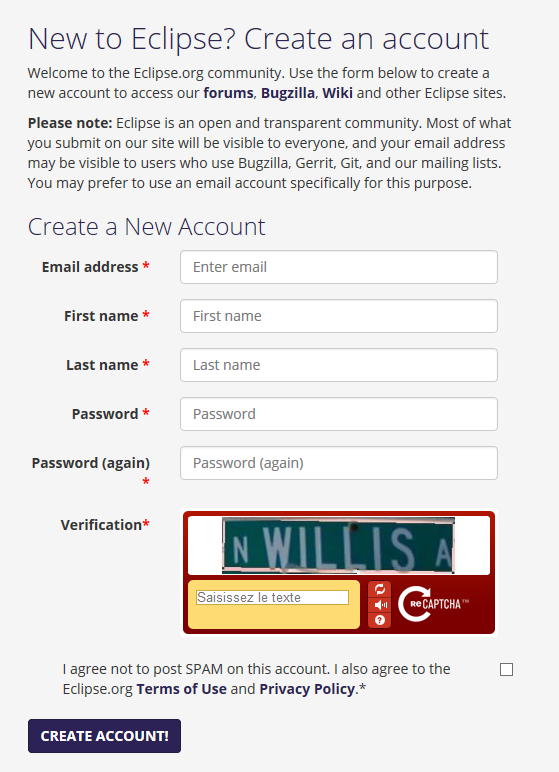
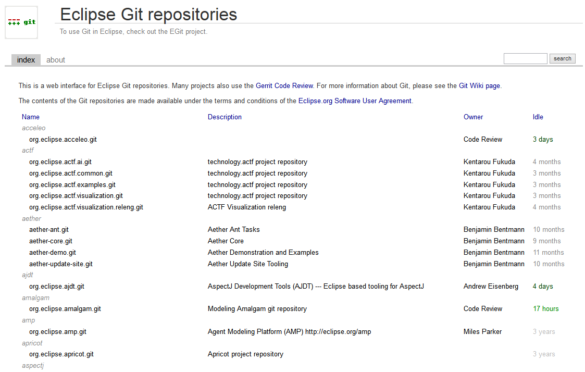
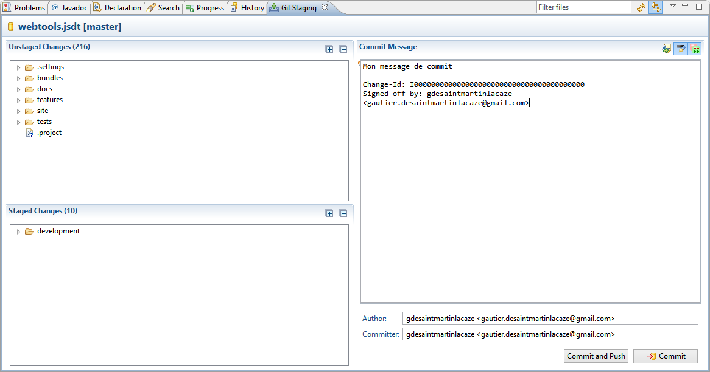
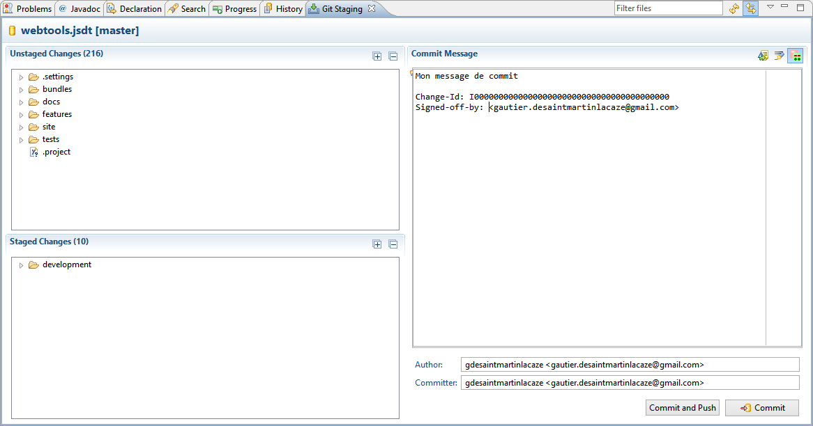
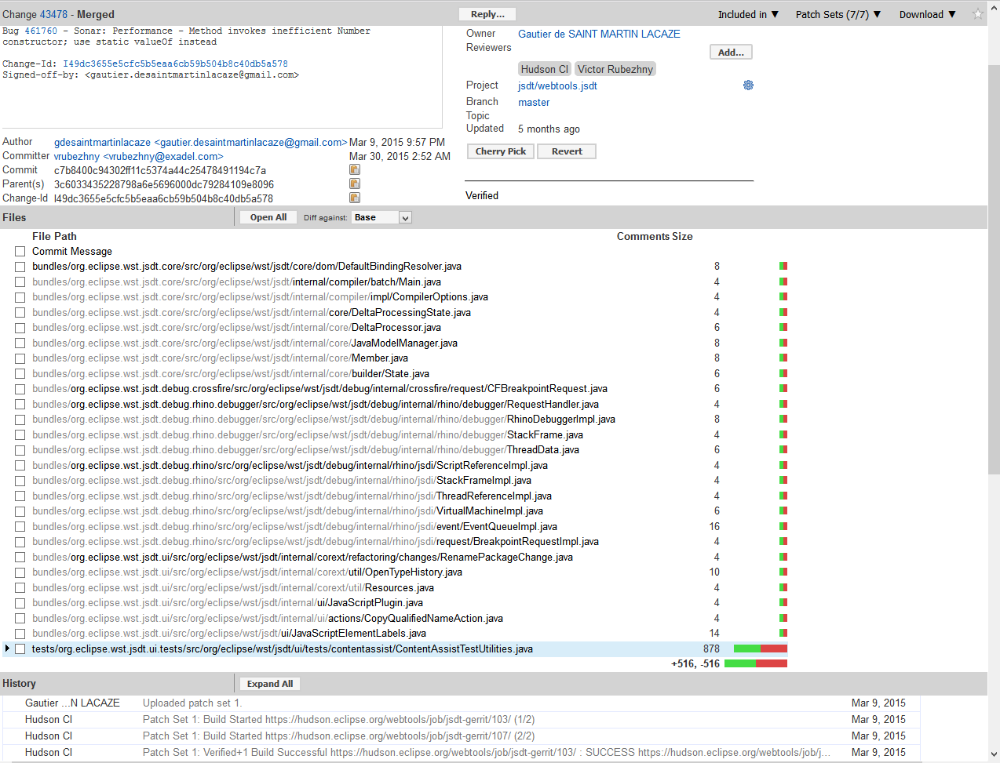
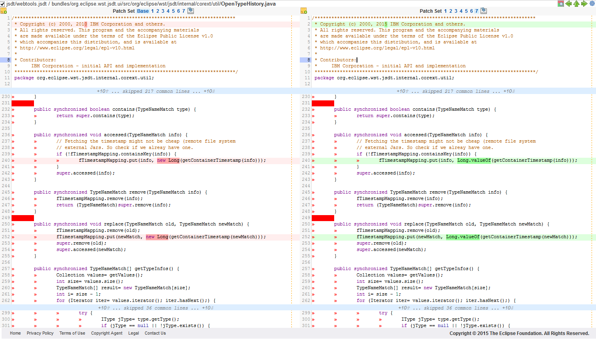

= Comment contribuer à un projet Eclipse ?
:source-highlighter: highlightjs
:revealjsdir: ../reveal.js
:revealjs_theme: white

== Qui suis je ?

Gautier de SAINT MARTIN LACAZE

Développeur Java / JavaScript en freelance

Twitter : https://twitter.com/darkjabberwock[@darkjabberwock]

== Sondage

== C'est quoi contribuer ?

[%step]
* Rapporter les bugs
* Proposer des améliorations
* Assister les utilisateurs
* Fournir du code

== Les outils de la fondation Eclipse 

[%step]
* Un bugzilla
* Forum / mailing-list 
* Un wiki
* Git / Gerrit

== Les étapes à suivre

[%step]
* Créer un compte
* Signer le CLA
* Récupérer le code (git)
* Modifier le code
* Commiter
* Pusher sur Gerrit
* Faire les aller-retour avec l'équipe

== Création d'un compte 

== Création d'un compte 

== Signer le CLA

Eclipse Foundation Contributor License Agreement

Plus d'info : http://www.eclipse.org/legal/CLA.php

== Récupérer le code

A la fondation directement : https://git.eclipse.org/c/

Mais également sur github : https://github.com/eclipse

== Encore faut-il le trouver...

== Encore faut-il le trouver...

image::2015-09-contribuer-projet-eclipse/lost-in-the-sea.gif[Lost in the code repositories]

== Ecrire du code

== Bien écrire son message de commit

* Ajouter un "Change-Id"
* Ajouter un signed-off-by

== Bien écrire son message de commit

== Configurer le push vers Gerrit 

* Générer des clés ssh
* Changer l'url de push
** ssh://gdesaintmartinlacaze@git.eclipse.org:29418/jsdt/webtools.jsdt

== Pousser et c'est ok

== Amender le commit et repousser

== Vérification du push

== Comparaison de fichier en ligne

== Questions ?

== Liens utiles	

* Bugzilla : https://bugs.eclipse.org/bugs/
* Forum : https://www.eclipse.org/forums/
* Mailing lists : https://dev.eclipse.org/mailman/listinfo
* Wiki : https://wiki.eclipse.org/Main_Page
* Page wiki pour Gerrit : https://wiki.eclipse.org/Gerrit